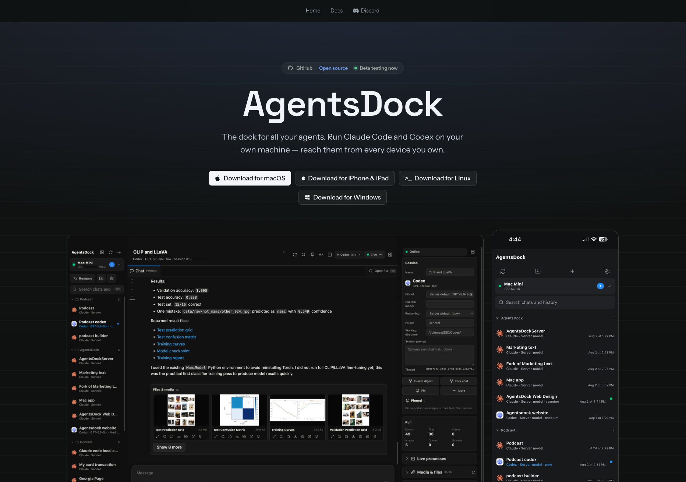

# AgentsServer



**AgentsServer is the self-hosted execution backend for
[AgentsDock](https://agentsdock.net).** AgentsDock provides
the polished desktop and mobile chat experience; AgentsServer runs on the
machine that owns your workspaces and agent CLI installations.
Together they provide persistent agent chats without routing private project
files through a third-party chat service.

The desktop and mobile client is also open source:
[ZhengyiLuo/AgentsDock](https://github.com/ZhengyiLuo/AgentsDock).

## Features

- Run agent chats from desktop and mobile, with persistent history.
- Work with files, images, videos, scheduled jobs, and persistent terminals.
- Use Claude Code, Codex, Cursor, or OpenCode where supported by your server
  release, client, and installed CLI.
- Run independent servers on the same machine.

## Get started

Use a Linux or Apple silicon macOS host with
[`uv`](https://docs.astral.sh/uv/getting-started/installation/) installed.
Install and authenticate the agent CLI you want to use on that host.
`tmux` is optional for terminal access and managed updates.

AgentsDock desktop can guide you through **Set up AgentsServer**. To install
from this repository instead:

```bash
git clone https://github.com/ZhengyiLuo/AgentsDock.git
cd AgentsDock/server
./install.sh
```

The installer starts the default server, normally on port **7850**, and prints
its URL and access token. Add that URL/token pair in AgentsDock. To show the token
again without restarting:

```bash
./install.sh --show-token
```

For access from another network, connect the server and your device through
Tailscale. Keep access tokens private and do not expose the agent port directly
to the public internet. See the [setup guide](https://agentsdock.net/setup.html)
for detailed instructions.

### Memory at launch

New agent turns require **2 GiB (2048 MiB) of available server RAM** by default;
scheduled jobs require **4 GiB (4096 MiB)**. This is a launch check, not total RAM or a
guarantee that every workload will fit. Low-memory errors show the available
amount, required minimum, and recovery advice. See [memory settings](docs/MEMORY_ADMISSION.md)
for operator overrides.

## Multiple servers on one machine

Add a separate server without replacing your original/default server:

```bash
# Create a server with an automatic name and free port
./instances.sh new

# Or choose its name and port
./instances.sh new --name work --port 7851

# List all servers and their connection URLs
./instances.sh list

# Uninstall one server (replace work with its name)
./uninstall.sh --instance work
```

Uninstall asks for confirmation and preserves history by default. Bare
`./uninstall.sh` selects all servers; use `--instance` to select just one.

Named instances retain separate legacy service units. The default server keeps
the current split service lifecycle; `--execution-mode split` is rejected for
named instances to avoid taking over the default gateway.

## Updating

For the default server installed from a checkout:

```bash
git pull --ff-only
./install.sh
```

Updates preserve its token and chat history. AgentsDock Settings also supports
signed server updates. See the [update guide](https://agentsdock.net/update.html).

## Documentation and support

- [Detailed API, configuration, and lifecycle reference](docs/SERVER_REFERENCE.md)

- [Setup and connection help](https://agentsdock.net/setup.html)
- [AgentsDock features](https://agentsdock.net/features.html)
- [Server releases](https://github.com/ZhengyiLuo/AgentsServer/releases)
- [Report a server issue](https://github.com/ZhengyiLuo/AgentsServer/issues)
- [Contributing and tests](CONTRIBUTING.md)

Features in this checkout may not yet be in a published release. The maintained server source is this repository's `server/` directory. The
standalone AgentsServer repository remains a compatibility distribution during
the update migration.

## License

AgentsServer's original code and documentation are licensed under the
[Apache License 2.0](LICENSE). See [NOTICE](NOTICE) for attribution.
Third-party components retain their respective copyrights and licenses.
